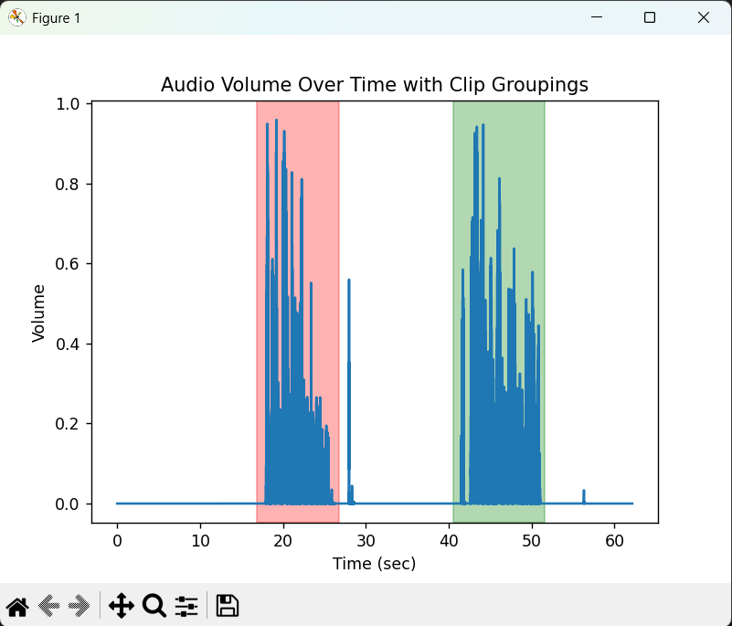

# Audio-Based Video Clip Extractor

This script processes a video file, analyzes its audio track, detects non-silent
segments, and automatically creates a new edited video composed only of those
segments. It is useful for removing long silent parts from recordings such as
lectures, meetings, or screen captures.

# Requirments
- Python 3.x installed

Install dependencies
```powershell
py -m pip install -r requirments.txt
```

# Usage

Run the script from the command line:

```powershell
py main.py input_video.mp4
```

**During execution**

An audio volume graph may be displayed if *SHOW_VISUAL* is enabled, e.g.

This show a volumn vs time graph, the clippable region are highlighted. In this example, there are 2 clips that are detected, and they will be join together to form the final video. This graph can be used to evaluate the final result (Number and length of clips) before commiting to the editing.

Note that the region is slightly bigger than the activated volume period, it is *padding* the clip with some silence before and after each period to make the final result flow more natrually.

**Finally**

The output file will be saved as:
[filename]_edited.mp4

# Parameters

The following constants can be modified at the top of the script:

| Setting               | Description                                                     |
|-----------------------|-----------------------------------------------------------------|
| SHOW_VISUAL           | Show the graph before editing. If false, it'll go straight to editing |
| CLIP_BLANK_SEC_START  | Seconds of padding added before detected audio                 |
| CLIP_BLANK_SEC_END    | Seconds of padding added after detected audio                  |
| MIN_CLIP_SEC          | Minimum duration (in seconds) of a clip |
